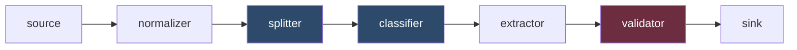
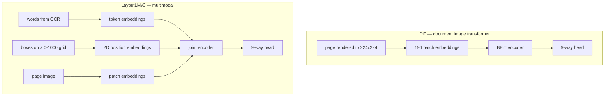
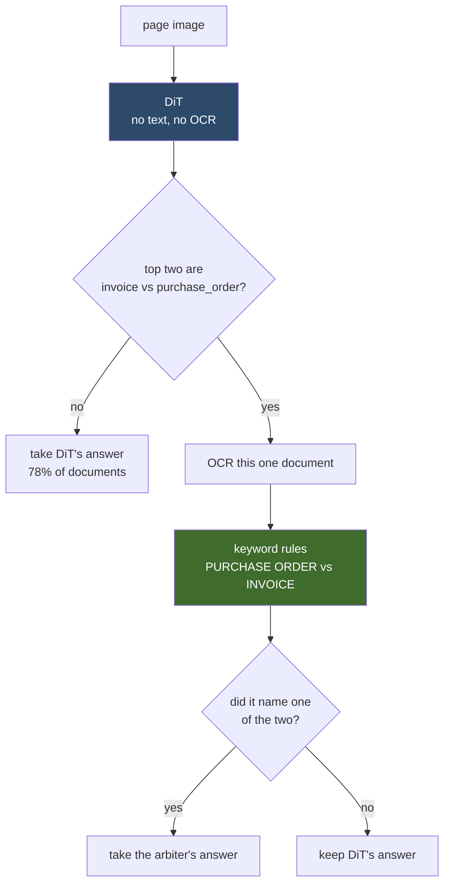
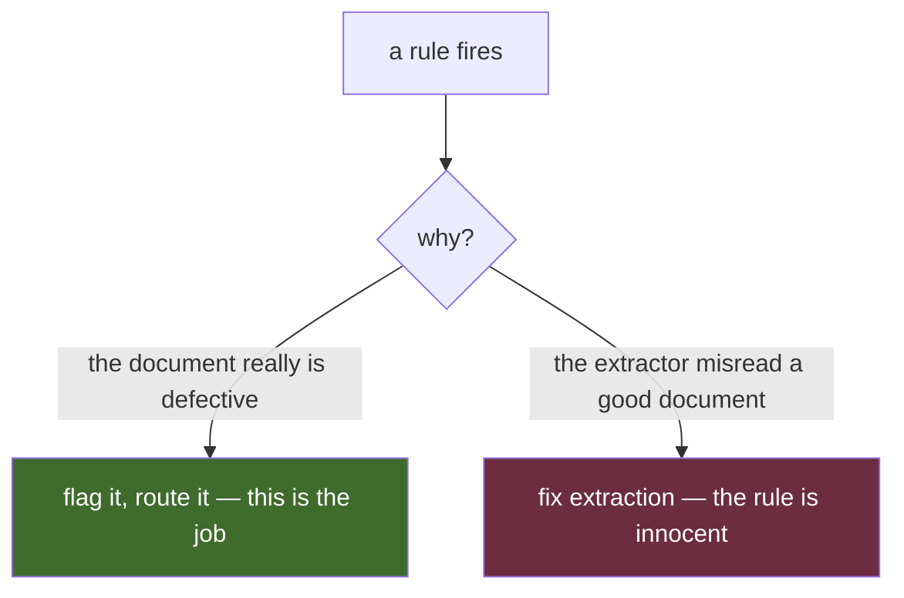
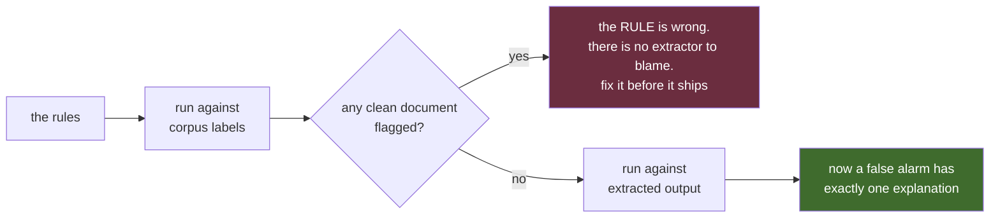

# What a document is, and whether it's wrong

## Phases 3 and 4 of building an intelligent document processing pipeline

Two phases ago this system could read fields off a document. It could not tell you what
the document *was* — the corpus handed it the type — and it could not tell you when it
had got something wrong. This is the story of closing both gaps, and of the three
occasions where the measurement I built to check my work turned out to be the only
thing standing between me and publishing a number that was flattering and false.

The short version: a vision model that reads document images beat every model that
also read the words, until I fixed the corpus and it stopped being true. A splitter
that used a machine learning model lost to nine lines of code that split on every page.
And a suite of validation rules that scored 0.918 against ground truth scored 0.564
against real pipeline output — which turned out to be the most useful number in the
project, because the gap was entirely attributable to something other than the rules.

---

## Where we were

The pipeline is a chain of plugin slots, each swappable by editing one manifest file:

Phases 0 through 2 built the right-hand side: a synthetic corpus with ground-truth
labels, a scoring harness anchored by two baselines, an extractor that turns a page of
text into schema-constrained fields, and an OCR stage for documents that arrive as
images. Phase 3 is the two blue boxes. Phase 4 is the red one.

The ordering is deliberate. Every phase retires a risk that could kill the project, and
ends with a number rather than a demo. If a phase can't produce a number you'd stake a
decision on, it isn't finished.

---

## Phase 3: working out what a document is

### The problem is not what it looks like

"Classify a document" sounds like a solved problem. Five types, a few hundred training
examples, any reasonable model gets high nineties. And that's exactly what happened: an
LLM reading the text scored **0.990** on clean documents.

The interesting part is the two ways that number lies.

**First lie: the type isn't the whole answer.** The extractor doesn't want a type, it
wants a *schema*. And one of my five types — `form` — carries five variants whose field
sets differ by more than a name:

| variant | fields the extractor asks for |
|---|---|
| onboarding | 22 |
| loan | 19 |
| claim | 13 |
| w4 | 9 |
| w9 | 9 |

A classifier that answers `form` has answered half the question. The other half — which
of 22 fields versus 9 — was still being read off the corpus label file. Forms are 45% of
the corpus. The classifier scored 1.000 on them and the thing that actually selected the
schema was still ground truth.

So the label set is generated from the type registry itself, and there are **nine
labels, not five**: `form:w9`, `form:onboarding`, `invoice`, and so on. Generating it
from the registry rather than writing it down twice means the classifier and the
extractor cannot drift into disagreeing about what the possible answers are.

**Second lie: 0.990 on clean documents, 0.571 on faxes.**

### The fax gap is not a comprehension problem

The corpus produces every document at four fidelities: clean, a decent office scan
("light"), a phone photograph with perspective distortion, and a 170 dpi bitonal fax.

**[IMAGE 02: the same invoice at four profiles — clean, light, photo, fax, side by
side at equal scale]**

The LLM loses 42 points between the first and the last. It's tempting to reach for a
better model. But the cause is upstream: **docTR finds 62% of the words on a fax page**.
The other 38% are not misread. They are never found. No amount of reading recovers a
word that was never there.

Which raised a question worth checking before training anything: if the *glyphs* are
destroyed, is the *geometry*?

I measured it with no model at all. Take the word boxes, throw away the words entirely,
render the positions into a coarse ink-occupancy grid, and nearest-neighbour it against
the clean corpus:

| profile | word retention | layout fidelity | type accuracy from ink position alone |
|---|---|---|---|
| light | 0.954 | 0.983 | 1.000 |
| photo | 0.938 | 0.958 | 0.997 |
| fax | 0.645 | 0.772 | **0.875** |

A fax keeps two-thirds of its words and three-quarters of its layout — and **position
alone identifies the document type better than the LLM reading the text does**.

**[IMAGE 03: a fax page with docTR's word boxes drawn in red over it — the text is
visibly illegible, the boxes are visibly structured. This is the whole argument in one
picture.]**

That took half an hour and it justified everything that followed. It's also the kind of
check worth doing before a fine-tune, not after: it converts "a layout model might help"
into "geometry survives at 0.772 fidelity, so a layout model has something to work
with."

### DiT and LayoutLMv3: what they actually read

Two models, and the difference between them is the whole story.

**DiT** is a vision transformer pretrained self-supervised on 42 million document
images. Its input is pixels and nothing else. It has no idea what any word says.

**LayoutLMv3** takes three streams: the tokens, a bounding box for each token
normalised to a 0–1000 grid, and the page image as patches. It fuses them *inside* the
model with learned weights — which is strictly more expressive than running two models
and averaging their probabilities, a point that matters later.

Two conventions here are easy to get wrong and fail silently. Boxes must be integers on
the 0–1000 grid, not PDF points, and the page rectangle has to come from the same PDF
the words came from. And the image is page one, so the words must be page one too — a
model shown page one's picture beside page three's words is being trained on a
contradiction. I assembled all three in one function for exactly this reason.

There's also a rasterisation trap. I first rendered pages *directly* to 224×224, which
point-samples a 170 dpi bitonal fax onto a grid coarser than its own strokes: table
rules and text rows drop out depending on where the grid lands, and the page arrives
looking cleaner and emptier than it is. Rendering at 4× and downsampling averages those
strokes into grey, which is what tells an image model a line was there.

### The result that was too good

Held out by document, DiT scored **1.000** on faxes. Better than LayoutLMv3's 0.958.
The image alone beat the image plus the words.

I wrote that up. It was wrong, and the reason is the most important methodological point
in this post.

**A perfect score on a generated corpus is a reason for suspicion, not celebration.**
Every document of a type is drawn from a handful of templates. Holding out *documents*
cannot distinguish a model that learned what an invoice is from one that memorised what
*this corpus's* invoices look like.

At the time, invoices had three page designs and purchase orders had two. So I rebuilt
the generator to produce **ten structurally distinct designs** for each of invoices,
purchase orders and multi-bill invoices — not recolourings, which would inflate the
count and teach nothing, but different arrangements: a centred formal sheet, a typewriter
statement, a zebra-ruled grid, bordered panels, a full-height dark sidebar, an
amount-due hero, detachable remittance coupons.

**[IMAGE 01: contact sheet of the ten invoice designs, 5×2 grid. This is the single most
important image — it makes "template memorisation" concrete.]**

Then I held out a whole *design*:

| held out by | overall | fax | purchase orders |
|---|---|---|---|
| source document | 0.958 | 0.917 | 0.938 |
| **page design** | **0.792** | **0.694** | **0.125** |

Fourteen of sixteen purchase orders read as invoices.

Not a data shortage — nine PO designs were still in training. It's a distinction the
model never had to learn. An invoice and a purchase order are both a header, a ruled
line-item table and a totals block. What separates them is a phrase printed at the top
of the page.

**[IMAGE 04: an invoice and a purchase order side by side at the same scale, with the
title phrase circled on each. Structurally near-identical.]**

With two or three templates per type, memorising each template stood in for the concept
and looked exactly like understanding. Ten designs took that away, and the model had
nothing left.

**So the earlier conclusion — that dropping the text made the model better — was an
artifact of a corpus with almost no design variety.** The text branch looked like dead
weight because the image branch was cheating.

### How DiT and the text work together

Once you know *which* pair fails and *why*, the architecture writes itself.

Both candidates are right about almost everything and fail in different places. DiT is
excellent except on invoice-versus-PO. A model with the words resolves that pair
outright. So: run the image model first, and consult the text **only** where it is known
to be needed.

The order is the entire economy of it. DiT reads no text, so it costs a page render.
The text path costs an OCR pass — hours over a thousand degraded documents. Text-first
would spend that on every document to fix a minority and throw away the one property
that makes the stage cheap.

Result on unseen page designs:

| | DiT alone | cascade |
|---|---|---|
| purchase_order → invoice | 4 | **0** |
| invoice → purchase_order | 2 | **0** |
| **overall** | **0.778** | **0.944** |

Two design decisions in there are worth stating because both were measured rather than
assumed.

**The escalation trigger.** I expected to need a confidence floor as well as the pair
trigger. Measured: the pair trigger alone scores 0.944 and escalates 22% of documents;
adding a 0.90 confidence floor escalates 56% and scores *exactly the same* 0.944. Every
extra escalation was a document DiT was going to get right anyway — and each one is an
OCR pass. So the floor is zero.

**The arbiter's authority is deliberately narrow.** The keyword classifier scores 0.700
overall and 0.350 on multi-bill invoices. It is nobody's classifier. But asked a single
question — invoice or purchase order, given something else already narrowed it to those
two — it is exact and free. *A weak classifier can be a strong arbiter.* It only ever
gets to pick between the two types the primary was weighing; any other answer, including
a coarser one, leaves the primary's answer standing.

That last rule exists because the first version didn't have it. The keyword baseline has
no notion of form variants, so its bare `form` overwrote `form:w9` and cost four
documents the schema that asks for 22 fields rather than 9. The cascade was *worse* than
the model it wrapped until I fixed it.

### Splitting: the free option won

A scanned batch doesn't arrive one document per file. So the generator now builds
bundles — several documents concatenated, with the page each one starts on recorded — and
half the joins deliberately place a document after another of its own type, because
that's the join a change-of-type splitter cannot see.

Three splitters, and both baselines are always reported:

| splitter | F1 | files exactly right | merged | over-cut |
|---|---|---|---|---|
| `single` — the file is one document | — | 0.108 | 213 | 0 |
| **`every_page` — each page is a document** | **0.938** | **0.783** | **0** | 28 |
| `by_type` — classify each page, cut on change | 0.772 | 0.458 | 62 | 27 |

The classifier-driven splitter lost to cutting everywhere. 92% of documents in this
corpus are a single page, so cutting everywhere is wrong 28 times, while `by_type` misses
62 same-type joins — 0.487 recall on exactly the joins it was predicted to be blind to.

I then wired the splitter into the pipeline so it actually produces documents the next
stage consumes, ran the chain end to end, and it corrected a claim I'd already written
down. I'd argued over-cuts were the cheaper failure because they show up as missing
fields. They don't:

**[IMAGE 05: a two-page multi-bill invoice, both pages side by side, with page 2 labelled
"the classifier reads this as a plain invoice"]**

A two-page multi-bill cut in half yields a second half with a header, a table and
totals — and the repeated per-service structure that identifies the type sitting on the
page that got cut away. Wrong schema, filled confidently. **Both failure directions can
invent.**

### What Phase 3 cost

The phase's actual deliverable: extraction over the same 175 documents, same model and
prompts, one thing varying — where the type came from.

| type from | field accuracy | exact match |
|---|---|---|
| the corpus | 0.959 | 0.809 |
| **the pipeline** | **0.957** | **0.809** |

Two thousandths across 1,904 graded fields. The classifier placed all 175 correctly,
type and variant, so the extractor received the same schema either way.

Read that as production conditions on designs the classifier has trained on. The number
that predicts an unseen vendor template is the design-holdout **0.944**, not this one.
Quoting 0.957 as evidence of generalisation would be quoting the easy case.

---

## Phase 4: telling when it's wrong

### The trap this stage is built around

A validator reads an extracted document and says what's wrong: the line items don't sum
to the subtotal, the SSN isn't nine digits, the loss was reported before it happened. My
corpus carries 352 documents with 527 deliberately injected defects across 38 classes.

The problem is that **a validator runs on extracted output, and extraction is
imperfect**. When a rule fires there are two explanations, and they demand opposite
responses:

Nothing in the firing distinguishes them. A stage that can't separate them reports a
defect rate that is partly its own extraction error, and the number moves when you swap
models for reasons that have nothing to do with the rules.

So every rule is scored **twice**, and the first run is a gate rather than a result:

This is the same discipline Phase 0 established by demanding the scorer return exactly
1.000 when fed the ground truth as its own prediction. **A validator suite with no
self-test is a suite that grades the extractor and calls it a defect rate.**

### The self-test earned its place immediately

Two rules were caught being wrong before they ever saw a prediction.

`overlapping_service_periods` fired on **40 clean documents**. I'd written it to detect
two services billed for overlapping periods — double-charging the same time. But services
on one bill are normally billed over the same month. Overlap isn't a defect at all.
Reading the generator's injector rather than tuning my threshold showed what's actually
injected: one section's period copied *verbatim* onto another. Duplication, not overlap.
That took 40 false alarms to 2.

Those last 2 are chance collisions on genuinely clean documents. So the rule can't gate
anything — it's a **warning** now, and the self-test counts only errors. A rule that
can't be certain shouldn't be able to fail a build; a bill charging one period twice
still deserves a look.

The second failure was worse because it was silent. My employment-date rule compared
`start_date` and `end_date`. The schema carries `start_year` and `end_year`. It found no
field, compared nothing, and reported a clean **0.000** — indistinguishable from the
defect simply being absent.

I made that same mistake three times: `start_date`, `adjuster` (it's `adjuster_name`),
and the W-9 TIN (which is `ssn` *or* `ein` depending on `tin_type`, so it isn't a check
on any single field at all). There's now a test asserting every required field name
exists on the variant it's demanded of.

And the largest class was worse than a wrong name. The signature block is printed on
every form and was recorded on *none* of them — it lived in the generator's render
metadata rather than its labels. 89 defects, the two biggest classes in the catalogue,
with no ground truth to compare against and no schema field to arrive in. Every
validator was blind to them by construction. Recording them moved document recall from
0.883 to **0.974**.

### The number, measured through the extractor

| scored against | precision | recall | document recall |
|---|---|---|---|
| the corpus labels — *does the rule work* | 0.911 | 0.918 | **0.974** |
| extracted output — *does the pipeline work* | 0.701 | 0.564 | **0.777** |

Because the gate is clean, that drop has exactly one attributable cause. And the
per-code table says where it goes:

- `missing_bill_to` **0.000**, `missing_vendor` 0.154, `missing_invoice_number` 0.455 —
  the extractor **supplies a value the document doesn't have**. That's fabrication, the
  Phase 1 failure mode still alive on every field nobody thought to mark optional.
- `no_skills_listed` 0.000 and both employment-date classes — resumes. The **third
  independent instrument** to land on resumes, after the extraction score of 0.820 and
  the `target_role` field at 0.086.

One row is genuinely undecidable rather than missed. `tax_miscalculated` reads 0.000
because a tampered tax and a tampered total both present as `subtotal + tax ≠ total`, and
nothing printed on the page says which figure was touched. Those documents *are* caught —
under `total_mismatch`, which is why its precision reads 0.345 while document recall
holds. Wherever the corpus tags a cause the page cannot distinguish, per-code recall
understates the stage. That's why document-level recall is reported beside it: "was this
routed to a person" is what the stage is actually for.

### The most useful thing this stage does isn't validation

Run the rules against extracted output from the **clean** corpus — documents with no
injected defects at all — and 24 of 175 get flagged. Every one is a false positive.

But rule correctness is already established at zero. So those 24 are extraction bugs,
found without a single label.

I spot-checked rather than asserting it. A resume whose ground truth gives employment
years of 2022 and 2021 came back with `start_year` and `end_year` **null on every role**.
The validator was right and the extractor had dropped the data.

**A validator firing because the extractor invented a value is not a false alarm. It is
a bug report.** The stage is a defect detector and an extraction-error detector at the
same time, and the second job may be the more valuable one.

### And then the fax

The degraded corpus is derived from the clean one, so it carries no injected defects.
Every finding is a false alarm by construction, and the rate answers the question the
whole gated design was built to make answerable:

| profile | documents | flagged | false-alarm rate |
|---|---|---|---|
| clean | 175 | 24 | 0.137 |
| light | 76 | 10 | 0.132 |
| photo | 51 | 12 | 0.235 |
| **fax** | **48** | **36** | **0.750** |

Three out of four clean faxes are reported as defective.

The rules did not change. The self-test still says they're correct. **On a fax they are
measuring OCR quality wearing a validator's name** — and the codes confirm it:
`line_item_math_error` ×29 and `section_line_item_math_error` ×25, which is precisely
what misread digits do to arithmetic.

Note that light degradation costs *nothing*: 0.132 against clean's 0.137. The damage
isn't gradual. It arrives with the fax.

This has a hard consequence for the next phase, and I'd rather write it down now than
discover it there: **you cannot route on validator findings for fax documents.** Doing so
sends three quarters of the good ones to a person. A defect signal is only actionable
where the extraction beneath it is trustworthy.

Which is the same shape as Phase 2's lesson about confidence: *a signal is useful only
where it is calibrated, and the place you most want to trust it is the place least likely
to deserve it.*

---

## What I'd take from this

**Baselines are not a formality.** The trivial splitter beat the model-driven one.
The keyword classifier — 0.700 overall, nobody's classifier — became the arbiter that
took the system from 0.778 to 0.944. Neither would have been visible without reporting
the free option beside the clever one every single time.

**A perfect score on synthetic data is a bug report about your holdout.** DiT's 1.000
was real memorisation, and the only way to find it was to make the corpus harder and
watch the number fall. If you generate your evaluation data, you must hold out the
*generator's* axes of variation, not just its outputs.

**Silent failures are the expensive ones.** Three of my validator rules checked fields
that didn't exist and reported a clean 0.000 — identical to the defect being absent. A
rule that finds nothing and a rule that looks in the wrong place produce the same number.
The fix was a test that asserts field names against the schema, and it exists because I
made the mistake three times.

**Measure the thing you'll actually ship.** Every extraction number in this project
before Phase 3 — including the headline 0.986 — was produced with the corpus handing
over the document type. That's a legitimate way to isolate a variable, and it's also a
pipeline that cannot run without its own answer key. The cost of removing it turned out
to be 0.002. It could just as easily have been 0.2, and I wouldn't have known.

**Two stages disagreeing about one document is a design smell.** The validator reads the
type registry to decide what's required, rather than keeping its own list, because a
field Phase 1 marked optional must not be demanded by Phase 4 — otherwise the extractor
gets punished for obeying its instructions.

Phase 5 is calibration and routing: turning these signals into a decision about which
documents a person sees. It now starts with a constraint that came from evidence rather
than intuition — on faxes, the defect signal is noise, and the routing has to know that.

---

*The corpus, the harness, every plugin and every number here are reproducible from a
seed. Each phase closes with a number and the holdout it was measured under, because a
number whose provenance is unknown is not a measurement.*
